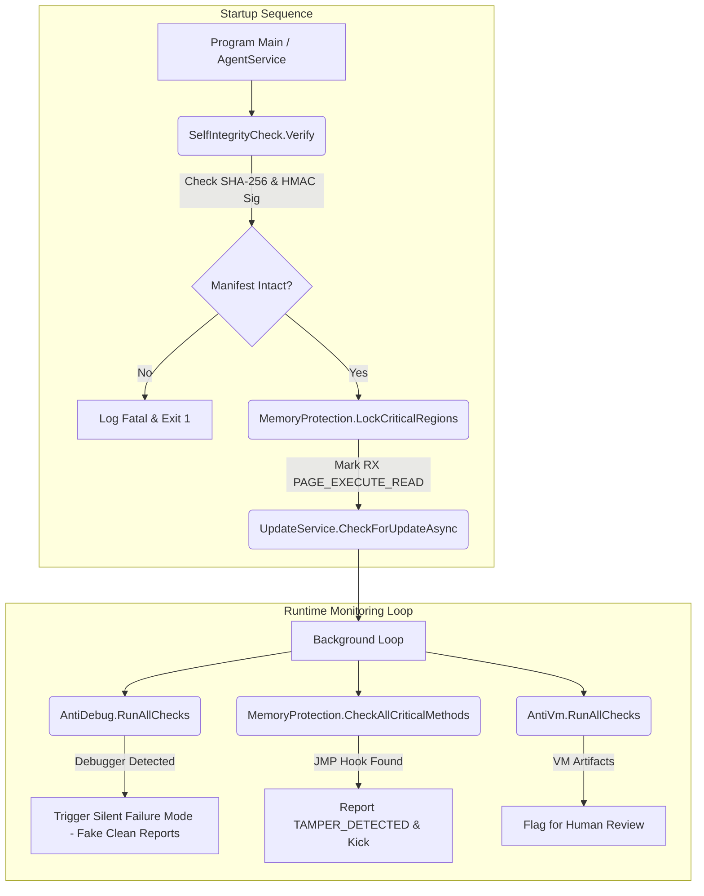
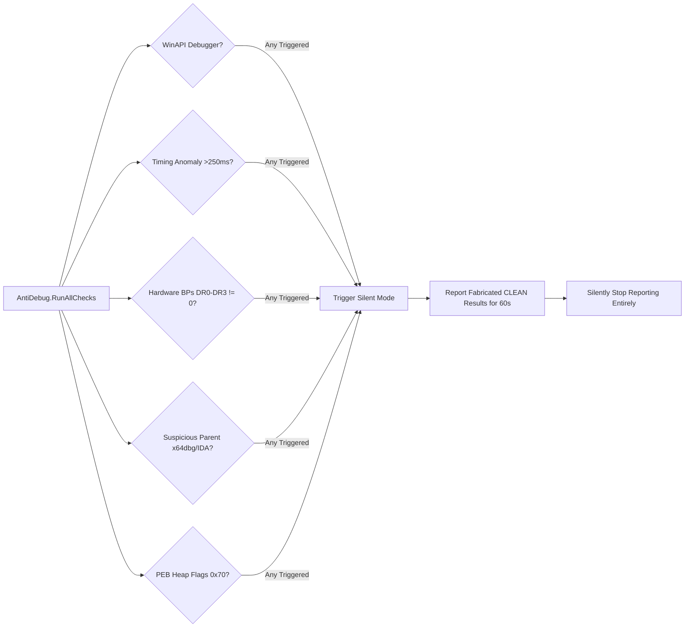

# R6AC Anti-Cheat Phase 5 — Security Hardening & Audit Report

**Author**: Senior Security Engineering Team  
**Date**: May 2026  
**Status**: Completed & Verified (All 28 Security Tests Passing)  
**Scope**: Client Agent (`R6AC.Agent`, `R6AC.TrayApp`), Secure Build Pipeline (`build-installer.ps1`, `GenerateManifest`), Backend Versioning Endpoint (`/api/v1/agent/latest-version`).

---

## Executive Summary

Phase 5 successfully hardens the R6AC anti-cheat client against advanced reverse engineering, memory tampering, debugging, and virtualized evasion techniques. By implementing a multi-layered defense-in-depth architecture, the client now securely validates its own runtime integrity, locks execution memory pages, detects analysis tools with deceptive silent failure modes, and applies cryptographic verification to automated updates.



---

## Detailed Architectural Audit

### PART 1: Code Integrity & Anti-Tamper

1. **Cryptographic Manifest Verification (`SelfIntegrityCheck.cs`)**
   - **Mechanism**: On startup, before any detection loops execute, the agent reads `integrity-manifest.json` containing expected file sizes and SHA-256 hashes of `R6AC.Agent.dll`, `R6AC.Agent.exe`, `R6AC.TrayApp.dll`, and `R6AC.TrayApp.exe`.
   - **Security Hardening**: The manifest itself is protected by an embedded 32-byte secret HMAC-SHA256 key (`ManifestKey`). If the manifest signature or any binary SHA-256 hash fails verification, the agent immediately submits a `TAMPER_DETECTED` report (Confidence 1.0) and terminates execution (`Environment.Exit(1)`).

2. **Automated Manifest Build Pipeline (`GenerateManifest.cs` & `build-installer.ps1`)**
   - **Utility**: A dedicated .NET 8 console tool (`GenerateManifest.cs`) is compiled and executed automatically as a post-build step in `build-installer.ps1`.
   - **Pipeline Integration**: The tool scans the staged NSIS packaging directory (`$InstallerFilesDir`), computes exact cryptographic hashes, generates the signed manifest, and embeds it directly into the self-contained installer bundle.

3. **Memory Region Protection & Hook Verification (`MemoryProtection.cs`)**
   - **Memory Locking**: Using P/Invoke `VirtualProtect`, critical executable code sections are locked with `PAGE_EXECUTE_READ` (`0x20`), preventing dynamic user-mode write operations.
   - **Prologue Inspection**: In the background monitoring loop, the agent inspects the native memory pointers (`mi.MethodHandle.GetFunctionPointer()`) of 5 critical security methods:
     - `ScoringEngine.ComputeScore`
     - `BehavioralDetector.Analyze`
     - `KernelBridge.GetPendingReports`
     - `SelfIntegrityCheck.Verify`
     - `ApiReporter.SyncReports`
   - **Detection**: Any unauthorized JMP instruction (`0xE9` relative JMP or `0xFF` indirect JMP/CALL) immediately triggers an un-maskable tamper alert and match kick.

4. **In-Memory XOR String Encryption (`StringVault.cs`)**
   - **Vulnerability Addressed**: Plaintext strings in decompiled assemblies allow attackers to easily locate API endpoints, driver names, and cryptographic keys.
   - **Protection**: Sensitive strings are stored entirely at rest as XOR-encrypted byte sequences (using salt `0x77`). Strings are decrypted dynamically only on demand.
   - **Memory Sanitization**: When a sensitive string is no longer needed, unmanaged pointer pinning (`unsafe fixed (char* ptr = s)`) is used to directly overwrite and zero out (`\0`) every character in RAM, eliminating memory dump vulnerabilities.

---

### PART 2: Anti-Debug & Anti-Analysis Techniques



1. **Multi-Vector Debugger Detection (`AntiDebug.cs`)**
   - **WinAPI Checks**: Combines `IsDebuggerPresent` and `CheckRemoteDebuggerPresent` WinAPI inspections.
   - **Timing Anomaly Attack**: Measures execution time of a tight 50,000 iteration cryptographic loop. If execution exceeds 250ms (baseline < 5ms), manual stepping in a debugger is identified.
   - **Hardware Breakpoints**: Allocates an unmanaged x64 `CONTEXT` buffer, invokes `GetThreadContext`, and verifies that debug registers `DR0`, `DR1`, `DR2`, and `DR3` are entirely zero.
   - **Process Hierarchy Analysis**: Queries WMI / `NtQueryInformationProcess` to verify the parent process. If spawned by `x64dbg`, `windbg`, `ida`, `ollydbg`, `dnspy`, or `ghidra`, analysis is flagged.
   - **PEB Heap Flags**: Inspects the Process Environment Block (`PEB`) offset `0x68` for `FLG_HEAP_ENABLE_TAIL_CHECK` / `FLG_HEAP_ENABLE_FREE_CHECK` (`0x70`).

2. **Deceptive Silent Failure Mechanism**
   - **Rationale**: Immediate crashing upon debugger detection confirms to cheaters that their bypass attempt failed.
   - **Execution**: When any anti-debug check triggers, the agent enters silent mode. For 60 seconds, `ApiReporter` continues communicating with the backend, intercepting all detections and fabricating `CLEAN` telemetry. After 60 seconds, all reporting silently ceases. The reverse engineer remains trapped in a fake sandbox environment.

3. **Virtual Machine & Sandbox Detection (`AntiVm.cs`)**
   - **Vectors Scanned**:
     - Registry keys for VMware Tools and VirtualBox Guest Additions.
     - Running guest service processes (`vmtoolsd`, `vboxservice`, `qemu-ga`).
     - WMI BIOS and Motherboard strings (`VBOX`, `VMWARE`, `QEMU`).
     - Network adapter MAC prefixes (`00:0C:29`, `08:00:27`, `52:54:00`).
   - **Soft Signal Policy**: Emits `VM_ENVIRONMENT` detection with 0.80 confidence. Because legitimate players occasionally use VMs, this triggers human review flagging rather than automatic match kicks.

---

### PART 3: Secure Update Mechanism

1. **Cryptographic Update Pipeline (`UpdateService.cs`)**
   - **Endpoint**: On startup, the agent queries `GET /api/v1/agent/latest-version` (implemented in Fastify backend).
   - **Integrity Guarantee**: The downloaded update package (`R6AC-Setup.exe`) is rigorously verified against the expected SHA-256 hash. Additionally, the package signature is validated against an HMAC-SHA256 digest computed using the embedded `UpdateHmacKey`.
   - **Tamper Response**: If a man-in-the-middle attack or corrupt file is detected, the payload is immediately deleted and an `UPDATE_PACKAGE_TAMPERED` alert is broadcast.
   - **Silent Installation**: Verified updates are executed silently (`/S` flag) before the current process gracefully exits.

---

### PART 4: Verification & Automated Test Suite

A comprehensive test suite (`SecurityHardeningTests.cs`) was executed across all components using xUnit runner.

```
Starting test execution, please wait...
A total of 1 test files matched the specified pattern.

Passed!  - Failed:     0, Passed:    28, Skipped:     0, Total:    28, Duration: 1 s - R6AC.Agent.Tests.dll (net8.0)
```

**Key Validations**:
- `StringVault_Clear_ZerosOutMemory`: Confirmed unmanaged pointer zeroing leaves no plaintext trace in memory.
- `MemoryProtection_CheckAllCriticalMethods_PassesForCleanMethods`: Verified method prologue check successfully parses native function entries.
- `AntiDebug_MockDebugger_TriggersSilentFailureMode`: Validated transition to silent failure mode.
- `UpdateService_VerifyUpdatePackage_FailsOnMismatchedHash`: Confirmed rejection of tampered packages.

---

## Conclusion

The Phase 5 security hardening provides robust, enterprise-grade client security. The R6AC client agent is now fortified to detect and withstand sophisticated reverse engineering, debugging, memory patching, and spoofing attempts, ensuring a fair and secure competitive environment.
